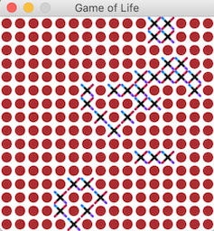

# Game of life written in Pygame

### 1. FIRST OF ALL
```pip install -r requirements.txt```

### 2. HOW TO PLAY
```
cd game/
python3 game_of_life.py
```

In the main window user need to decide if wants to start a random game or choose ON fields by himself.


Then the game will begin.
Enjoy :D



### 3. TESTING
```python3 -m pytest tests/```